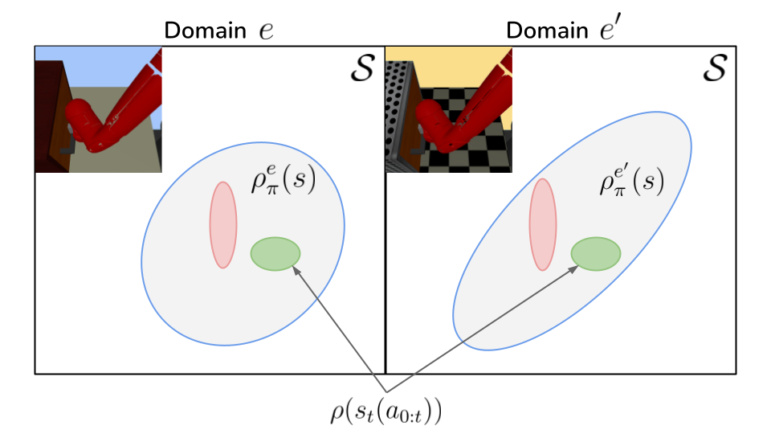
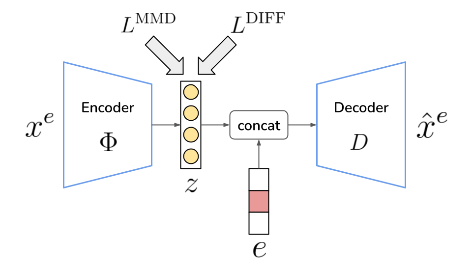
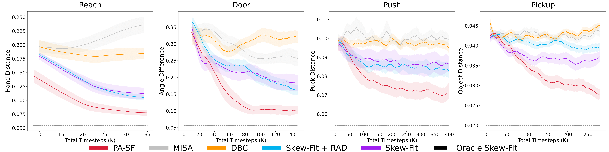
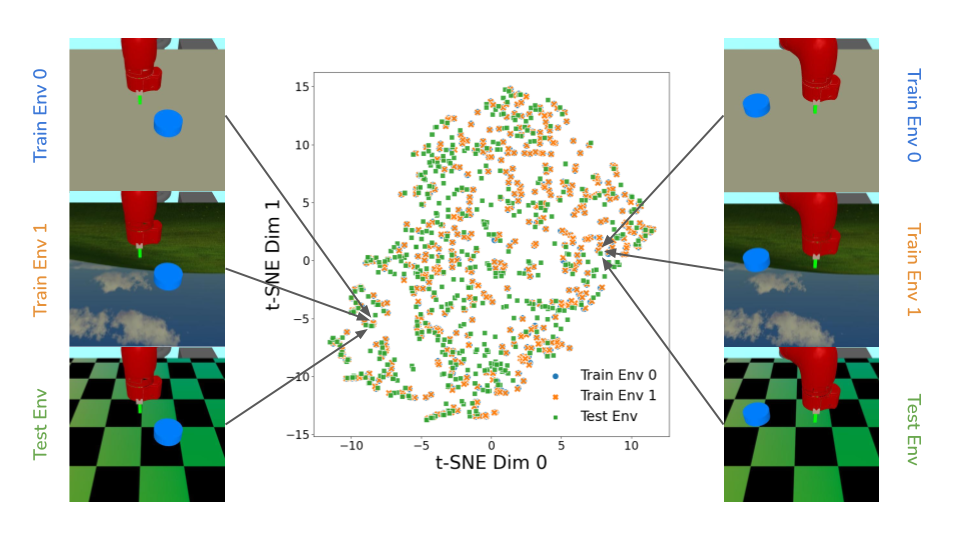

# Learning Domain Invariant Representations in Goal-conditioned Block MDPs

<p align="center"> Beining Han, &nbsp; Chongyi Zheng, &nbsp; Harris Chan, &nbsp; Keiran Paster, &nbsp; Michael R. Zhang, &nbsp; Jimmy Ba</p>

<p align="center">
   <a href="https://arxiv.org/abs/2110.14248">paper</a>
</p>

<p align="middle">
  
  
</p>

**Summary**: Deep Reinforcement Learning agents often face unanticipated environmental changes after deployment in the real world. These changes are often spurious and unrelated to the underlying problem, such as background shifts for visual input agents. Unfortunately, deep RL policies are usually sensitive to these changes and fail to act robustly against them. This resembles the problem of domain generalization in supervised learning. In this work, we study this problem for goal-conditioned RL agents. We propose a theoretical framework in the Block MDP setting that characterizes the generalizability of goal-conditioned policies to new environments. Under this framework, we develop a practical method PA-SkewFit (PASF) that enhances domain generalization. 

```
@article{han2021learning,
  title={Learning Domain Invariant Representations in Goal-conditioned Block MDPs},
  author={Han, Beining and Zheng, Chongyi and Chan, Harris and Paster, Keiran and Zhang, Michael and Ba, Jimmy},
  journal={Advances in Neural Information Processing Systems},
  volume={34},
  year={2021}
}
```

## Installation

Our code was adapted from [Rlkit](https://github.com/rail-berkeley/rlkit) and was tested on a Ubuntu 20.04 server.

This instruction assumes that you have already installed NVIDIA driver, Anaconda, and MuJoCo. 

You'll need to get your own MuJoCo key if you want to use MuJoCo.

### 1. Create Anaconda environment

Install the included Anaconda environment

```
$ conda env create -f environment/pasf_env.yml
$ source activate pasf_env
(pasf_env) $ python
```

### 2. Download the goals

Download the goals from the following link and put it here: `(PASF DIR)/multiworld/envs/mujoco`.

- https://drive.google.com/drive/folders/1L9SYFADWmFzdP1c6wf2yo2WjOlXJh8Iu?usp=sharing

```
$ ls (PASF DIR)/multiworld/envs/mujoco
... goals ... 
```

### 3. (Optional) Speed up with GPU rendering

Note: GPU rendering for mujoco-py speeds up training a lot but consumes more GPU memory at the same time.

Check this Issues: 

- https://github.com/openai/mujoco-py/issues/581
- https://github.com/openai/mujoco-py/issues/512

Remember to do this stuff with the mujoco-py package inside of your **pasf_env**.

## Running Experiments

<p align="middle">
<!--    -->
   
</p>

The following command run the PASF experiments for the four tasks: Reach, Door, Push, Pickup, in the learning curve respectively.

```
$ source activate pasf_env
(pasf_env) $ bash (PASF DIR)/bash_scripts/pasf_reach_lc_exp.bash
(pasf_env) $ bash (PASF DIR)/bash_scripts/pasf_door_lc_exp.bash
(pasf_env) $ bash (PASF DIR)/bash_scripts/pasf_push_lc_exp.bash
(pasf_env) $ bash (PASF DIR)/bash_scripts/pasf_pickup_lc_exp.bash
```

- The bash scripts only set , , and  with the exact values we used for LC.
But you can play with other hyperparameters in python scripts under `(PASF DIR)/experiment`.

- Training and evaluation environments are chosen in python scripts for each task. You can find the backgrounds in `(PASF DIR)/multiworld/core/background` and domains in `(PASF DIR)/multiworld/envs/assets/sawyer_xyz`.

- Results are recorded in `progress.csv` under `(PASF DIR)/data/` and `variant.json` contains configuration for each experiment.

- We simply set random seeds as 0, 1, 2, etc., and run experiments with 6-9 different seeds for each task.

- Error and output logs can be found in `(PASF DIR)/terminal_log`.

<p align="middle">
  
</p>

## Questions
If you have any questions, comments, or suggestions, please reach out to Beining Han (bouldinghan@gmail.com) and Chongyi Zheng (chongyiz@andrew.cmu.edu).

